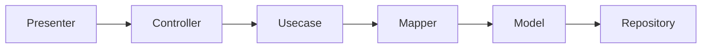
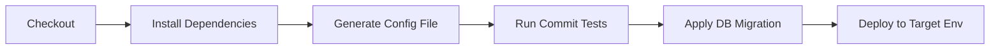

# fx_rate_history_backend

Backend API of FX Rate History application

## Get started

Install project dependencies and start local server.

```#!/bin/bash
sh utilities/install_dependencies.sh
pipenv shell
npx sls generate-env
npx sls wsgi serve --host 0.0.0.0
```

## Design Pattern



## Dependency Management

**Pipenv** manages the python dependencies which are specified in `Pipfile`.
> Generated `Pipfile.lock` should be committed to ensure the consistency of every deployment.

```#!/bin/bash
# install python dependencies (including dev packages)
mkdir .venv; pipenv install -d

# or
# install python and serverless framework dependencies

sh utilities/install_dependencies.sh

# run a script under virtual environment
pipenv run pytest -v

#or
# activate shell in a virtual environment
pipenv shell

# add runtime dependencies
pipenv install {package_name}

# add dev dependencies
pipenv install {package_name} --dev
```

## Config Management

> Only selected developers has permission to access these configs.

Environment specific configs and sensitive information are stored in serverless dashboard.

```#!/bin/bash
# generate config file
npm run posttest
```

## Commit Testing

> Testing and linting settings can be configured in `tox.ini` file.

### Unit Testing

**Pytest** is the main tool for unit testing. It also relies on other packages such as:

- `pytest-cov` for code coverage
- `pytest-dotenv` for faking configs
- `py-event-mocks` for AWS Lambda event stubs

```#!/bin/bash
# run unit tests
npm run test
```

### Source code analysis

TODO

## DB Migration

Database migrations are handled by alembic. Alembic creates migration script if changes were made in `models.py`.

- Initialize db migration structure

  ```sh
  npx sls flask-db-init
  ```

- Create migration script from database model changes

  ```sh
  npx sls flask-db-rev
  ```

- Apply migration scripts

  ```sh
  npx sls flask-db-up
  ```

## Packaging and Deployment



## Documentation

The `flask-restx` package allows auto generation of swagger API documentation. See `swagger.json`

```#!/bin/bash
# generate swagger doc
npx sls generate-doc
```
